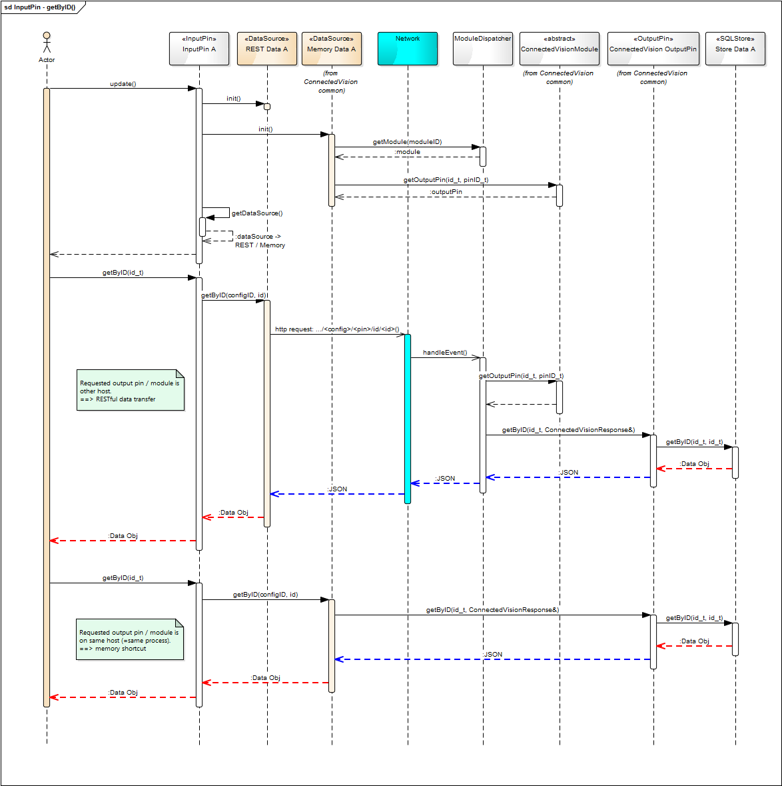
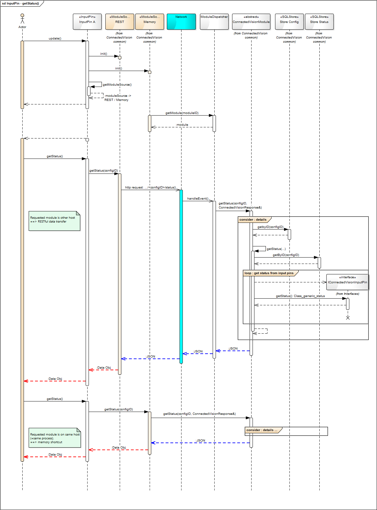

= Memory Shortcut Review/Summary

_Stephan Veigl, Michael Rauter_

_7. Oktober 2014_

[[new-files]]
== New Files:

* `IDataSource.h`: +
templated interface class providing definitions for data-getter functions (e.g. _getByIndex()_) +
implementations of this interface will be a _REST_–based _DataSource_ or the Memory _DataSource_ (Memory Shortcut)
* `DataSource_REST_BaseClass.h`, +
`DataSource_REST_BaseClass.cpp`: +
_REST_ implementation of _IDataSource_ interface
* `DataSource_Memory_BaseClass.h`, +
`DataSource_Memory_BaseClass.cpp`: +
memory shortcut implementation of _IDataSource_ interface
* `Class_RawData.h`, +
`Class_RawData.cpp`: +
_DataSource_ needs a template argument for its instantiation – default case would be a json data object, but for custom/rawdata input pins _Class_RawData_ is provided.
* `IModuleSource.h`: +
interface to provide module/config specific information from different sources (_REST_, memory)
* `ModuleSource_REST_BaseClass.h`, +
`ModuleSource_REST_BaseClass.cpp`: +
_REST_ implementation of _IModuleSource_ interface +
* `ModuleSource_Memory_BaseClass.h`, +
`ModuleSource_Memory_BaseClass.cpp`: +
memory shortcut implementation of _IModuleSource_ interface

[[modified-files]]
== Modified Files

input pin files make use of the new mechanism:

* `ConnectedVisionInputPin.h`
* `ConnectedVisionInputPinControl.cpp`
* `ConnectedVisionInputPinData.cpp`

[[removed-files]]
== Removed Files

These files were removed:

* _REST_ stores are no longer required since the _DataSource_ mechanism completely makes them obsolete – thus all corresponding files were removed +
`Store_REST_*.h`, +
`Store_REST_Stub_*.h`
* `Store_REST_BaseClass.h`, +
`Store_REST_BaseClass.cpp`

[[ideageneral-mechanism]]
== Idea/General mechanism

Bypass network stack within same process (on same computer) +
 +
Implemented via _DataSource_/_ModuleSource_ mechanism which is implemented as a polymorphic pointer to the interface and the actual implementation is chosen at runtime depending if the two modules (connected to each other) are resident in the same Connected Vision host service process.

This polymorphic pointer is defined in class _ConnectedVisionInputPinControl_ for _ModuleSource_ resp. class _ConnectedVisionInputPinData_ for _DataSource_.

Both are set in the _update_() function (via _getModuleSource()_ resp. _getDataSource()_ functions) of the _ConnectedVisionInputPinControl_ class resp. _ConnectedVisionInputPinData_ class. +
 +
If the two modules are in the same process memory shortcut will be used, otherwise _REST_ _DataSource_ will be used (an actual network request will be done).

Even for the memory shortcut the data objects are converted to json and back to C++ class instances. +
This is necessary because the object on the output pin side can have more elements than which are actually read on the input pin side.

[[implications-for-inputpins]]
== Implications for InputPins

Input pins that want to use the new memory shortcut mechanism need to inherit from _ConnectedVisionInputPinData<TDataObject>_ (see input pin InputPin_ArbitraryData.h in FileExport module).

<<<

[[figures-and-diagrams]]
== Figures and Diagrams

